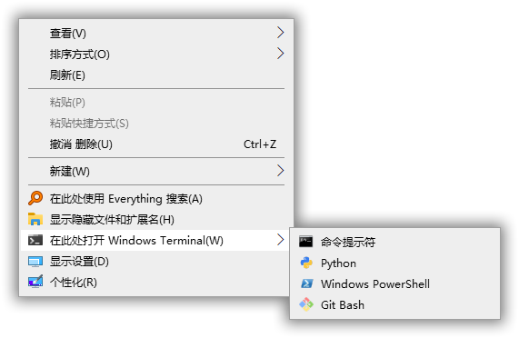

# My Python Learning Practice

### Add right-click context menu “Windows Terminal Here”

> Inspiring from this repository [*PowerShell Scripts to Install/Uninstall Context Menu Items for Windows Terminal*](https://github.com/lextm/windowsterminal-shell), I rewrote it in Python so that I can directly convert script into executable file without installing Powershell 7.

- Since packaged it into an exe file, you can directly [DOWNLOAD](https://github.com/coo11/PythonScript/releases/tag/v0.0.1) it and no need to install any dependencies.
- It works well in the Administrator account in Windows 10 2004 64-bit but running in other environment is not considered.
- If you installed this script and add new command-line interface to Windows Terminal, Just reinstall this script.
- After Installation, If icons are blank, you should rebuild icons cache.
- Recently its stuff add a right-click context menu *Open in Windows Terminal*. According to [this comment](https://github.com/microsoft/terminal/issues/7008#issuecomment-662621638), you can remove official context menu by running [this batch file](AddTerminalToContextMenu/RemoveOpenInWindowsTerminal.cmd).

### Some batch processing tool for ASS format subtitles

[View Details...](ASSPyTools/README.md#ass-字幕相关的批量处理脚本)

### A tool to stitch images as an irregular image grid

[View Details...](IrregularImageStitcher/README.md#不规则多宫格图片拼接)

### A utility to generate Clash Config.yaml

[View Details...](Clash/README.md)

# Some code snippets collected from Internet

### parse JSON File with commnet

[Source](https://zhuanlan.zhihu.com/p/99682140)

[View Code](Snippets\pJSONC.py)

# Some notes 

[PyInstaller Usage](AddTerminalToContextMenu/NOTE.md#使用-pyinstaller-打包)
